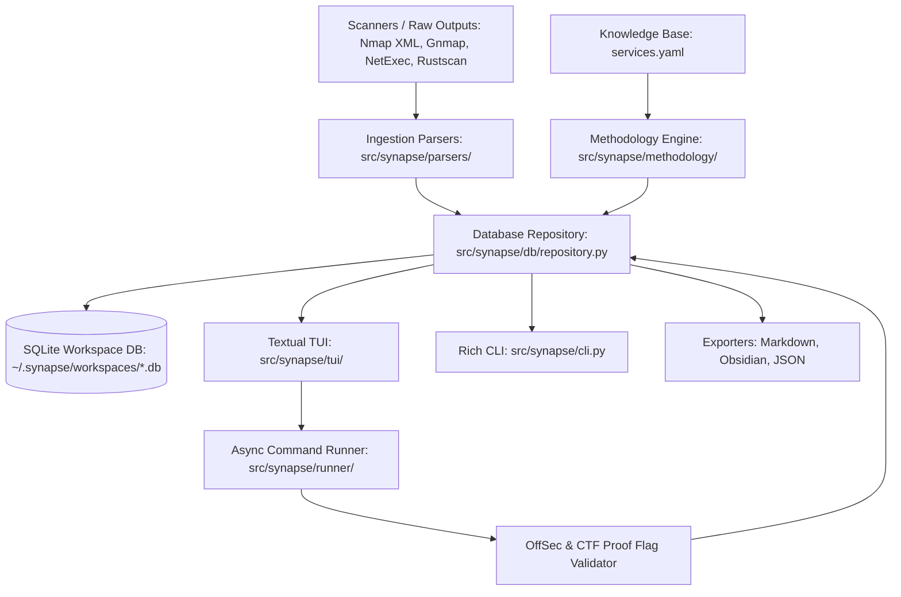

# 🏛️ SYNAPSE: System Architecture & Developer Blueprint

This document specifies the technical architecture, invariants, subsystem boundaries, and extension protocols of **Synapse**. It serves as the definitive reference for human developers and autonomous AI agents (such as Ox) extending or refactoring this codebase.

---

## 1. Core Invariants & Architectural Principles

1. **100% Offline-First & Deterministic:**
   - Synapse must function completely without internet access, external databases, or mandatory LLM APIs.
   - Any AI features (`src/synapse/ai/`) are strictly optional advisory layers with instant deterministic heuristic fallbacks.
2. **ACID State Machine:**
   - All state is persisted in an indexed SQLite database with Write-Ahead Logging (`WAL` mode), busy timeout protection, and cascading foreign keys.
   - Database operations must be transactional, idempotent, and resilient against unexpected process termination.
3. **Safe Subprocess Execution:**
   - Command executions via `src/synapse/runner/executor.py` must run in isolated POSIX process groups (`os.setsid`) to ensure that all descendant child processes are terminated on timeout without leaking orphan processes.
   - Tool outputs must be capped in memory to prevent exhaustion on giant wordlists or port scans.
4. **Clean Separation of Concerns:**
   - Parsers ingest raw scanner data into generic target dictionaries.
   - The Repository persists data into SQLite and returns Pydantic models.
   - The Methodology Engine matches services to YAML rules and renders command templates.
   - The TUI and CLI consume the Repository and Methodology Engine without direct SQL coupling.

---

## 2. System Component Topology



---

## 3. Subsystem Breakdown

### 3.1 Domain Models (`src/synapse/models.py`)
Defines the core entities using Pydantic:
- `Target`: Scope hosts (`ip`, `hostname`, `os`, `status`, `in_scope`, `tags`, `notes`).
- `Service`: Open ports (`port`, `protocol`, `name`, `product`, `version`, `banner`, `status`).
- `ChecklistItem`: Actionable methodology tasks (`category`, `title`, `command_template`, `status`, `severity`, `remediation`, `output_snippet`).
- `Credential`: Passwords, NTLM hashes, Kerberos tickets, and testing matrix (`tested_targets`).
- `Lead`: Prioritized attack hypotheses (`priority`, `severity`, `status`, `description`).
- `Evidence`: Proof logs, command outputs, MD5 flag hashes, and screenshot paths, each linked to its target, service, and the methodology check that produced it (`checklist_id`).
- `PivotRoute`: SOCKS tunnels, Ligolo-ng routes, and local port binds.

### 3.2 Storage Layer (`src/synapse/db/`)
- `schema.py`: Clean DDL statements with foreign keys (`ON DELETE CASCADE` on target services/checklists) and query indexes.
- `migrations.py`: Schema version manager that inspects `PRAGMA table_info` and applies non-destructive `ALTER TABLE` upgrades.
- `repository.py`: CRUD operations, cross-target lateral movement matrix updates, and engagement metrics calculation.

### 3.3 Parsers (`src/synapse/parsers/`)
- `nmap_parser.py`: Supports XML (`-oX`), Grepable (`-oG`), and normal text (`-oN`).
- `netexec_parser.py`: Extracts SMB, WinRM, MSSQL, SSH, and LDAP hosts, accounts, `LM:NTLM` hashes, and `Pwn3d!` administrative compromise indicators.
- `rustscan_parser.py` & `masscan_parser.py`: High-speed port scan list/JSON parsers.

### 3.4 Methodology Engine (`src/synapse/methodology/`)
- `data/services.yaml`: Comprehensive knowledge base covering 50+ network services, plus a top-level `initial_recon:` section of host-level phase-0 recipes (applied to targets before any service is discovered; only host-scoped variables like `{IP}` / `{HOST}` are valid).
- `engine.py`: Matches discovered services against port lists and regex patterns (`name_patterns`), rendering ready-to-run recipes by substituting `{IP}`, `{PORT}`, `{HOST}`, `{USER}`, `{PASS}`, `{DOMAIN}`. Also exposes `get_initial_recon_commands(target)` for service-less targets, and supports rendering without a service context (service-scoped tokens such as `{PORT}` remain unsubstituted).
- **Initial Recon loop (TUI, key `i`):** recon recipes execute through the standard Runner modal; if the captured stdout parses as Nmap text, discovered services are attached via the normal `add_or_update_service` + checklist pipeline — no separate persistence model exists for phase-0 items (evidence ledger records the run instead).
- **Seamless fallback (TUI, key `r`):** running a recipe with no service selected auto-routes to the Initial Recon flow, so fresh targets flow Target → recon → discovered services → methodology without dead ends.

### 3.5 Assessment Engine (`src/synapse/assessment/`)
Pure deterministic analysis over repository models — no SQL, no network, no LLM.
- `build_snapshots(targets)`: per-host `TargetSnapshot` aggregating known vs unknown vs tested state (services by status, checks by status, coverage ratio, valid creds, flags).
- `get_next_actions(...)`: prioritized investigations with rationale. Ordering: phase-0 gaps → confirmed-admin exploitation → untested enumeration surface → credential sprays → interrupted work → stale-lead housekeeping. Deterministically deduplicated and sorted; out-of-scope and ignored targets are excluded.
- `detect_rabbit_holes(...)`: `StuckReport` separating proven dead ends from untouched surface and un-sprayed credentials; `is_stuck` is the rabbit-hole signature (dead ends exist AND no open avenue remains in scope). Powers the TUI "I'm stuck" modal (key `s`); triage board on key `n`; live `NEXT:` hint in the stats banner consumes `get_top_action`.

### 3.6 Runner & Proof Extraction (`src/synapse/runner/`)
- `executor.py`: Executes commands asynchronously with configurable timeout and output capping.
- `extract_proof_flags(text)`: Validates 32-character hex MD5 hashes (OffSec `user.txt`/`proof.txt`) and CTF-style flags (`flag{...}`, `HTB{...}`, `EJPT{...}`).

### 3.7 Export & Reporting (`src/synapse/export/`)
- `notion_exporter.py`: Generates Notion-native structured Markdown bundles (`SYNAPSE Assessment Workspace.md`, nested `Targets/<ip>.md`, `Credentials.md`, `Leads & Hypotheses.md`, `Evidence & Flags.md`, `Pivoting & Networks.md`) with relative markdown links, Notion callout blocks, and database tables for Notion's *Import -> Markdown* workflow.
- `markdown_exporter.py`: Generates single-file Markdown reports tailored to OffSec/eJPT report structures, with sanitized table cells (`|` escaped) and safe code fences, as well as Obsidian note vaults.
- `json_exporter.py`: Lossless workspace JSON serialization and restoration (scope flags and evidence→service/checklist relationships are re-linked by identity, not stale IDs).

### 3.8 Terminal User Interface (`src/synapse/tui/`)
- `app.py`: Main Textual application with responsive layout, tabs (`1`–`5`), stats banner (with live `NEXT:` hint), state-aware triage (`n`), stuck/rabbit-hole modal (`s`), scope toggling (`o`), and credential lifecycle marking (`t` on the Creds tab). Service status is derived automatically from checklist state (`_refresh_service_state`).
- `widgets/`: Componentized views for `TargetTreeWidget` (scope-dimmed), `ServiceDetailWidget` (coverage + linked-evidence counts), `CredentialMatrixWidget` (per-host lifecycle + spray-gap column), `LeadBoardWidget`, `EvidenceViewWidget` (target/service/check relational columns), and `PivotViewWidget`.
- `modals/`: Isolated modal dialog screens with input focus safety, including `TriageModal` and `StuckModal`.

---

## 4. Extension Protocols (How to Extend Synapse)

### Protocol 1: Adding a New Parser
1. Create `src/synapse/parsers/<tool>_parser.py`.
2. Implement `parse_<tool>_output(content_or_path: Union[str, Path]) -> List[Dict[str, Any]]` returning standardized target dictionaries:
   ```python
   {
       "ip": "10.10.11.50",
       "hostname": "target.local",
       "os": "Linux",
       "services": [
           {"port": 80, "protocol": "tcp", "name": "http", "product": "nginx", "version": "1.18"}
       ]
   }
   ```
3. Register the parser in `src/synapse/parsers/__init__.py` and add routing in `src/synapse/cli.py` under `ingest`.
4. Add unit test in `tests/test_parsers.py`.

### Protocol 2: Adding a New Service Methodology
1. Open `src/synapse/methodology/data/services.yaml`.
2. Define the service section:
   ```yaml
   my_service:
     ports: [1234]
     name_patterns: ["^myservice"]
     checklists:
       - category: "recon"
         title: "Check Unauthenticated Status"
         description: "Query status endpoint"
         command_template: "curl -s http://{IP}:{PORT}/status"
         severity: "medium"
         remediation: "Enforce authentication on status endpoint"
   ```
3. Verified automatically by `tests/test_methodology.py`.

---

## 5. Testing & Quality Assurance

Run the test suite:
```bash
uv run pytest -v
```

All new features must include unit tests verifying:
- Happy path data flow
- Negative / malformed input resilience
- Database state transitions and persistence
