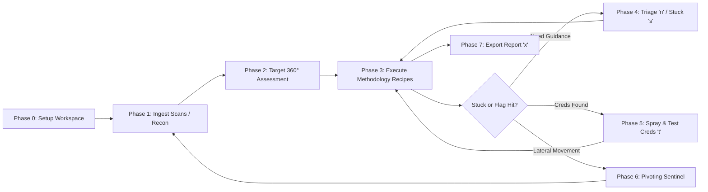

# CYB0X // Pentesting & eJPTv2 Master Operator Guide

> **CYB0X** is a tactical offensive state machine and interactive methodology copilot designed for penetration testers, CTF competitors, and certification candidates (**eJPTv2**, **eCPPT**, **OSCP**, **CRTP**, **PNPT**).
> It replaces scattered notes with a structured, keyboard-driven terminal dashboard that tracks attack surface coverage, identifies next high-probability attack vectors, prevents rabbit-holes, auto-extracts proof flags, and exports clean executive reports.

---

## 📑 Table of Contents
1. [Quick-Start Cheatsheet & Keyboard Shortcuts](#1-quick-start-cheatsheet--keyboard-shortcuts)
2. [Environment Setup & Diagnostics (`cyb0x doctor`)](#2-environment-setup--diagnostics)
3. [Step-by-Step eJPTv2 & Lab Attack Workflow](#3-step-by-step-ejptv2--lab-attack-workflow)
   - [Phase 0: Workspace & Scope Initialization](#phase-0-workspace--scope-initialization)
   - [Phase 1: Host Discovery & Scan Ingestion](#phase-1-host-discovery--scan-ingestion)
   - [Phase 2: Target 360° Assessment & Service Enumeration](#phase-2-target-360-assessment--service-enumeration)
   - [Phase 3: Interactive Methodology Execution & Flag Capture](#phase-3-interactive-methodology-execution--flag-capture)
   - [Phase 4: State-Aware Triage (`n`) & Rabbit-Hole Detection (`s`)](#phase-4-state-aware-triage-n--rabbit-hole-detection-s)
   - [Phase 5: Credential Vault Management & Password Spraying](#phase-5-credential-vault-management--password-spraying)
   - [Phase 6: Hypotheses, Leads & Scratchpad (`.`)](#phase-6-hypotheses-leads--scratchpad-)
   - [Phase 7: Network Pivoting & Route Sentinel](#phase-7-network-pivoting--route-sentinel)
   - [Phase 8: Instant Report & Vault Generation (`x`)](#phase-8-instant-report--vault-generation-x)
4. [Methodology Profiles (eJPTv2, Network, Web)](#4-methodology-profiles)
5. [Multi-Attempt Lab Strategies & Workspace Cloning](#5-multi-attempt-lab-strategies--workspace-cloning)
6. [CLI Command Reference](#6-cli-command-reference)

---

## 1. Quick-Start Cheatsheet & Keyboard Shortcuts

CYB0X is designed for pure keyboard speed without leaving the terminal.

| Key / Hotkey | Action | Purpose / Context |
|---|---|---|
| `Ctrl + K` | **Command Palette** | Search and trigger any action, tab, or tool without memorizing keys |
| `Ctrl + P` | **Fuzzy Jump** | Instantly search and jump to any Target, Port, Service, Cred, or Lead |
| `Ctrl + L` | **Workspace / Lab Switcher** | Hot-swap lab databases, create new labs, or clone attempts |
| `.` *(period)* | **Workspace Scratchpad** | Instant freeform markdown scratchpad for raw notes & observation dumps |
| `1` – `5` | **Tab Switcher** | `1` Workbench • `2` Creds • `3` Leads • `4` Evidence • `5` Pivots |
| `a` | **Add Target** | Add individual IP(s), hostnames, or entire CIDR subnets (`10.10.11.0/24`) |
| `i` | **Initial Recon** | Launch Phase-0 Recon on selected target (Nmap, Rustscan, Masscan) |
| `r` | **Run Recipe** | Open the selected methodology command in the interactive runner dialog |
| `n` | **Triage (Next Move)** | Computes the highest-probability attack vector from active state |
| `s` | **I'm Stuck** | Analyzes dead ends, un-sprayed credentials, and unexplored attack surface |
| `Space` | **Cycle Status** | Toggles check status (`TODO` → `RUNNING` → `CHECKED` → `FINDING` → `DEAD_END`) |
| `t` | **Cycle Credential** | On Creds tab: cycles test status (`untested` → `valid` [green] → `invalid` [red]) |
| `o` | **Toggle Scope** | Mark selected target In-Scope or Out-of-Scope (OOS targets filtered from next moves) |
| `c` | **Add Credential** | Save discovered password, NTLM hash, Kerberos ticket, or SSH key to vault |
| `l` | **Add Lead** | Log attack hypothesis (SQLi, SMB relay, privilege escalation path) |
| `e` | **Add Evidence / Flag** | Capture proof flag with automatic OffSec / CTF validation |
| `p` | **Methodology Profile** | Switch methodology framework (`eJPTv2`, `Network Pentest`, `Web App`) |
| `g` | **Guided Workflow** | View phase-by-phase completion progress for the active target |
| `x` | **Export Report** | Export engagement to Notion Workspace, Obsidian Vault, Markdown, or JSON |
| `T` | **Theme Switcher** | Switch color palette (Claudish, Claudish Light, Cyb0x dark) |
| `?` / `F1` | **Interactive Help** | View on-screen shortcut reference guide |
| `q` | **Quit** | Exit the TUI (all state is persistently saved in SQLite) |

---

## 2. Environment Setup & Diagnostics

Before beginning an exam or lab engagement, run `cyb0x doctor` from your terminal to verify that your Python runtime, SQLite engine, and external penetration testing tools are ready.

```bash
# Verify environment health and security tooling
cyb0x doctor
```

CYB0X checks for 20+ essential security tools across five core categories:
- **Port Scanning & Recon**: `nmap`, `rustscan`, `masscan`
- **Web Enumeration**: `ffuf`, `gobuster`, `feroxbuster`, `nikto`, `whatweb`, `sqlmap`, `curl`
- **Active Directory & SMB**: `netexec` (`nxc`), `crackmapexec`, `smbclient`, `enum4linux-ng`, `rpcclient`
- **Password Cracking & Auth**: `hydra`, `john`, `hashcat`
- **Network Pivoting & Tunnels**: `ligolo-ng`, `chisel`, `proxychains4`

---

## 3. Step-by-Step eJPTv2 & Lab Attack Workflow



---

### Phase 0: Workspace & Scope Initialization

1. **Launch a dedicated workspace for your lab or exam**:
   ```bash
   cyb0x -w ejpt-exam tui
   ```
   *(Or press `Ctrl + L` inside the TUI to create or switch workspaces on the fly).*

2. **Add target hosts or subnets**:
   - Press `a` in the TUI.
   - Enter your target IP (e.g. `10.10.11.200`) or subnet (`192.168.1.0/24`).
   - If you already know specific open ports from your exam letter, enter them (e.g. `22,80,445,3389`).

---

### Phase 1: Host Discovery & Scan Ingestion

You can discover services in two ways:

#### Method A: Direct Ingestion from CLI
Run your scanner tools and pipe or save output directly to Cyb0x:
```bash
# Nmap XML or Text scan ingestion
nmap -sV -sC -p- 10.10.11.200 -oX scan_monolith.xml
cyb0x -w ejpt-exam ingest scan_monolith.xml

# Fast Rustscan JSON ingestion
rustscan -a 10.10.11.200 -g -oJ rustscan.json
cyb0x -w ejpt-exam ingest rustscan.json

# NetExec / SMB discovery output
nxc smb 10.10.11.0/24 | tee netexec_smb.txt
cyb0x -w ejpt-exam ingest netexec_smb.txt
```

#### Method B: In-TUI Initial Reconnaissance
1. Select the target host in the left sidebar tree.
2. Press `i` (or `r` on an unscanned host).
3. Choose a recon recipe:
   - `Fast Port Discovery (Rustscan/Nmap top-1000)`
   - `Comprehensive Service Fingerprinting (Nmap -sV -sC -p-)`
   - `Stealth SYN Scan`
4. Press `Ctrl + R` in the runner modal. Cyb0x executes the scan in the background and **automatically attaches all discovered ports, service versions, banners, and methodology checklists directly to the target tree**.

---

### Phase 2: Target 360° Assessment & Service Enumeration

When clicking any target in the sidebar, CYB0X displays the **Target 360° Unified Operational Card**:

- **Status & Scope**: Live badge (`[DISCOVERED]`, `[FOOTHOLD]`, `[PWNED]`) and in-scope verification.
- **Operating System Detection**: Fingerprinted OS details (e.g. `Linux (Ubuntu 22.04 LTS)`, `Windows Server 2022`).
- **Attack Surface Summary**: Total services, methodology completion %, and confirmed valid credentials.
- **Discovered Ports Table**: Complete table of all open ports, protocols, identified software versions, and check coverage.

---

### Phase 3: Interactive Methodology Execution & Flag Capture

1. **Select a service** (e.g. `80/tcp http Apache httpd 2.4.49` or `445/tcp smb`).
2. Cyb0x automatically populates standard eJPTv2 / OSCP methodology action items:
   - *HTTP Directory & VHost Bruteforcing (`ffuf`, `gobuster`)*
   - *Known CVE Checks (e.g. Path Traversal, Log4j, RCE exploits)*
   - *SMB Anonymous Share Listing (`netexec`, `smbclient`)*
   - *Active Directory Kerberoasting & AS-REP Roasting*
3. **Execute customized commands**:
   - Highlight any check item and press `r`.
   - The command is pre-filled with target IP, port, and wordlists (fully editable).
   - Press `Ctrl + R` to execute asynchronously.
4. **Automatic Flag Detection (`⚑ FLAG HIT`)**:
   - When command output contains proof flag patterns (`HTB{...}`, `flag{...}`, `user.txt`, `root.txt`), Cyb0x's real-time regex engine **instantly flashes a prominent Flag Hit alert**.
   - Press `Ctrl + S` to save the output and proof directly into the Evidence Ledger.
5. **Cycle check status**:
   - Press `Space` to cycle status: `CHECKED` (completed benign), `FINDING` (vulnerability identified), `DEAD_END` (inconclusive).

---

### Phase 4: State-Aware Triage (`n`) & Rabbit-Hole Detection (`s`)

Exam success depends on avoiding 2-hour rabbit holes. CYB0X features a built-in deterministic assessment engine:

#### 1. State-Aware Triage (`n`)
Press `n` at any time to open the **Triage Assessment Window**:
- **Known Surface vs Unexplored**: Break down what has been enumerated versus remaining blind spots.
- **Top Next Action Recommendation**: Cyb0x evaluates the exact matrix of open ports, untested services, un-sprayed credentials, and priority leads to suggest the single highest-value next step.

#### 2. Rabbit-Hole & "I'm Stuck" Escape Analysis (`s`)
Press `s` when you feel blocked:
- Detects if you have marked multiple items as dead-ends on one service while leaving high-value services (SMB, Web, RPC) completely untested.
- Checks if you have harvested credentials that have not yet been tested on sister machines in the lab subnet.
- Highlights unexploited high-severity leads.

---

### Phase 5: Credential Vault Management & Password Spraying

Switch to **Tab 2: Credential Vault Matrix** (`2`):

1. **Record new credentials** (`c`):
   - Enter username, secret (password, NTLM hash, SSH private key), domain (`MONOLITH.LOCAL`), and target.
2. **Track validation across multiple hosts (`t`)**:
   - Highlight a credential and press `t` to cycle its validity on the target:
     - `UNTESTED` (gray) → `VALID ACCESS` (green) → `INVALID` (red)
3. **Password Spraying**:
   - As you pivot through a subnet, Cyb0x tracks which credentials have been confirmed against which machines, preventing redundant lockouts or duplicate sprays.

---

### Phase 6: Hypotheses, Leads & Scratchpad (`.`)

#### Attack Leads Board (`tab-leads` / `3`)
- Press `l` to add hypotheses (e.g. *"Check sudo -l on www-data for NOPASSWD vim"*, *"Potential AS-REP Roasting on svc_sql"*).
- Organize leads with severity ratings (`CRITICAL`, `HIGH`, `MEDIUM`, `LOW`) and status (`BACKLOG` → `IN_PROGRESS` → `CONFIRMED` → `REJECTED`).

#### Persistent Scratchpad (`.`)
- Press `.` from anywhere in the TUI to open the **Workspace Scratchpad**.
- Write freeform markdown notes, copy-paste exploit snippets, or jot down exam observations.
- Press `Ctrl + S` or `ESC` — notes are immediately persisted in SQLite metadata.

---

### Phase 7: Network Pivoting & Route Sentinel

Switch to **Tab 5: Pivoting & Route Sentinel** (`5`):

- Document dual-homed compromised hosts acting as jump boxes.
- Track internal victim subnets (e.g. `172.16.1.0/24`).
- Document active tunnel bindings:
  - *Ligolo-ng tun interfaces*
  - *Chisel SOCKS5 proxies (`127.0.0.1:1080`)*
  - *SSH dynamic port forwarding*

---

### Phase 8: Instant Report & Vault Generation (`x`)

When you finish the assessment or need documentation for your exam report:

1. Press `x` inside the TUI (or run `cyb0x export` from CLI).
2. Choose your export format:
   - **Notion Assessment Workspace**: Full database structure with targets, services, credentials, and evidence.
   - **Obsidian Knowledge Vault**: Interlinked `.md` notes with frontmatter tags and graph view relations.
   - **Markdown Engagement Report**: Clean executive summary with methodology checklist completion metrics, findings list, and proof flags.
   - **JSON Backup**: Full structured state snapshot for backup or grading.

---

## 4. Methodology Profiles

CYB0X methodology checklists are driven by YAML profiles located in `src/cyb0x/methodology/profiles/`:

- `ejptv2.yaml`: Aligned with eJPTv2 domains (Host & Network Penetration Testing, Web Application Penetration Testing, Assessment & Auditing).
- `network_pentest.yaml`: Focuses on network services, active directory exploitation, and internal pivoting.
- `web_application.yaml`: Focuses on OWASP Top 10, directory discovery, parameter fuzzing, and API security.

Press `p` in the TUI to switch between active methodology profiles on the fly.

---

## 5. Multi-Attempt Lab Strategies & Workspace Cloning

For certification prep and practice labs where you repeat boxes for speed:

1. Press `Ctrl + L` to open the **Workspace Manager**.
2. Select your original lab workspace (e.g. `ejpt-lab08`).
3. Click **"Clone for Attempt 2"** (`btn-clone`).
4. Cyb0x creates an isolated clone (`ejpt-lab08_attempt2.db`) allowing you to re-execute your attack run from scratch while keeping your previous notes and proof benchmarks safely preserved.

---

## 6. CLI Command Reference

| Command Line | Purpose |
|---|---|
| `cyb0x tui` | Launch the interactive terminal user interface |
| `cyb0x -w <name> tui` | Launch TUI directly into a named workspace |
| `cyb0x doctor` | Run environment readiness and tool checks |
| `cyb0x list-workspaces` | List all local workspace databases, targets count, findings, and flags |
| `cyb0x list-targets` | Print table of all registered targets and open ports |
| `cyb0x list-creds` | Display all credentials in vault (passwords masked by default) |
| `cyb0x list-commands` | View persistent command execution history and execution times |
| `cyb0x next <target_ip>` | Print AI / State-Aware copilot next move recommendations to stdout |
| `cyb0x ingest <scan_file>` | Ingest Nmap XML/gnmap, Rustscan JSON, Masscan JSON, or NetExec text |
| `cyb0x export -f notion -o ./notion` | Generate Notion assessment workspace |
| `cyb0x export -f obsidian -o ./vault` | Generate Obsidian Markdown knowledge vault |
| `cyb0x export -f markdown -o report.md` | Generate single Markdown engagement report |
| `cyb0x export -f json -o backup.json` | Export full workspace JSON state |
| `cyb0x import-backup backup.json` | Restore workspace state from JSON backup |

---

*CYB0X — Built for Precision, Speed, and Methodological Rigor in Offensive Security.*
